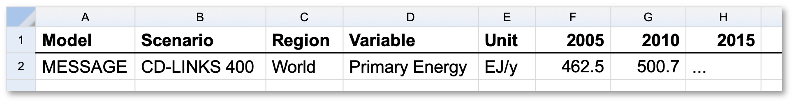

# README for pyam Converter Project

## Project Overview

This project automates the conversion of modeling results (CSV/Excel) from various energy system models into the pyam format. The goal is to standardize and efficiently prepare data for a data explorer or further analysis.

## Project Structure

```
amigdala-variable-converter/
│
├── konverter/
│   ├── 1_lookup_files.py                # Conversion logic for the PRISM model (example)
│   └── 1b_convert_regions_to_iso.py            # Other model converters
│   └── 2_mapping_utils.py            # Other model converters
├── input/                      # Input files (CSV/Excel, structured by model)
│   └── ...                            # currently containing files from Amigdala Poc1 and Poc2 runs
│
├── output/                     # Output files in pyam format
│   └── error_log.txt            # file, which will always be created after running the mapping-utils
│   └── ...                      # all the converted pyam files
│
├── dictionary_dataexplorer_variables_translation.xlsm       # Central mapping file/dictionary for variable names, regions, scenarios, models etc. Can be found on TNO sharepoint
├── overview_files_variables.txt            # List of files and variables which are to be converted
└── README.md                   # This file
```

## Setup

1. **Create a virtual environment**

   ```bash
   python -m venv venv
   # Activate (Windows)
   venv\Scripts\activate
   # Activate (Mac/Linux)
   source venv/bin/activate
   ```

2. **Install dependencies**

   ```bash
   pip install -r requirements.txt
   # or manually:
   pip install pandas openpyxl
   pip install ...
   ```

## Usage

0. **Maintain the mapping file**
   - The central dictionary or mapping file (`dictionary_dataexplorer_variables_translation.xlsm`) contains the mapping of original variables to pyam variables, as well as harmonized names for regions, scenarios etc. for all models.
   - This latest version of this file can be found on the TNO sharepoint
   
1. **Edit the config.yaml**
   - Update the information in the config.yaml file:
      - Where are the model results stored?
      - What files should be post-processed? Please use the exemplary file as a basis.<br>
      You can use `the 1_lookup_files.py` to get an overview of files relevant for processing
      - Where is the dictionary saved at? <br>
      Here you should download and use the latest version on the sharepoint.

2. **Check for files to convert**
   - First, the python script should be run which searches for all files to be converted.
      ```bash
        python konverter\1_lookup_files.py`
      ```
   - This script looks in every sub-folder defined in the `config`-file for `.xslx` and `.csv`-files
   - if you would only like to include the files from a specific PoC run, indicate the corresponding folder
   - Each model runs should be saved in a subfolder.
   - The output of this python scripts lists the following information in the resulting file `overview_input_files_unsorted.xlsx`.<br>
   They are almost already in the format necessary for the variables mapping-Excel file and contain these information:
      - model name
      - folder name
      - file name
      - sheet name
      - headers of the columns.
      
      For the following processing, the files must contain information about: `variable names`, `region`, `year`, `unit`, `value`<br>
         Please note, that some model output files contain multiple sheets, although not all of them are relevant.
   - These information should then be put into the `overview_files_variables.xlsx` file.
   - Please note that in case of the variable names, it might be possible that they are distributed over multiple columns, each with different names.
   In that case the column names containing the variables must be concatenated with "|", e.g.:<br> 
   `Variable|Sector|Subsector|Carrier`.  

3. **Run the conversion script**
   - Run the conversion script with:
     ```bash
     python konverter/2_mapping_utils.py
     ```
   - The script reads the input file(s), uses the dictionary (mapping file), and generates a pyam-compatible Excel file in the `output/` folder for each excel/csv-file which is being loaded.
   - The first time this script runs, it will find that all the variables have not been assigned to a new name, as well as regions, scenario or model names, which have not been listed in the dictionary. <br>
   These are listed in the terminal and the `error_log.txt` in the `output/` folder.
   - These information should be discussed bilaterally with the model owners and then updated in the dictionary file.
   - Re-run the conversion with the updated dictionary file until there are no more errors. 
   - All converte files are stored in the `/output`-folder named `pyam_MODELNAME_original-filename.xlsx`.
   > NOTE : To upload the data to the data explorer, the data must be put in one single file per model, or per scenario. This is not done yet. 

4. **Run the script to harmonize update region naming**
   - If necessary and some regions are named differently, e.g. with 2 or 3 letter codes or with other abbreviatons.<br>
   Use the following script to harmonize them:
      ```bash
      python konverter/1b_convert_regions_to_iso.py
      ```
   - This script uses the `country_converter` library to convert the regions to full names.
   Custom region names are stored directly in a python `dict`.
   - This script will convert the regions in the  `dictionary_dataexplorer_variables_translation.xlsm` file the sheet `regions` and create a new file `dictionary_dataexplorer_variables_translation-local_regions_fullname.xlsx` file.
   - The information can then be used to update the region list in the dictionary file.


5. **Check the result**
   - The output files should be checked and could be uploaded directly to the data explorer or used for further analysis.

## Notes

- The mapping file is the central place for all variable, unit, and metadata harmonization. Changes are made here and immediately reflected in the conversion.
- The script is designed to handle both cases:
  - Variables as columns (wide format)
  - Variables as values in a column (long format, e.g., "sortingstream")
- Each model can have its own conversion script, or you can generalize the logic for batch processing.
- The project structure is designed to be easily extendable (add more models, more mappings, etc.).

## Next Steps

- Integrate additional model files (which were not shared on the TNO Sharepoint) by adding them to the mapping file and creating new scripts if needed.
- Check the variable lists and update the amigdala-workflow repo and inform IIASA
- upload the data to the [data explorer](https://amigdala-internal.apps.ece.iiasa.ac.at/)


---

## Example: Final pyam/IAMC File Structure

The resulting Excel/CSV file will have the following structure:



Each row represents a unique combination of model, scenario, region, variable, and unit, with yearly data as columns:

| model | scenario | region | variable | unit | 2020 | 2025 | 2030 | ... |
|-------|----------|--------|----------|------|------|------|------|-----|
| PRISM | 1. W2.4-EU net0 | AUT | Recycling | t | 247411.99 | 54031.48 | 55913.79 | ... |
